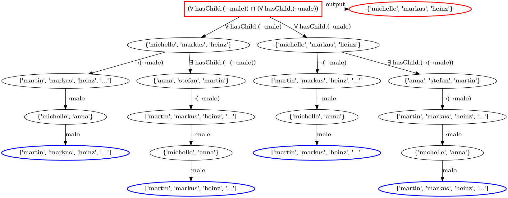

## Neural Reasoning for Robust Instance Retrieval

This repository provides the implementation of the Embedding-Based Reasoner dubbed EBR. With this repository, one can perform instance retrieval even within an inconsistent knowledge base. EBR leverages KGE to perform reasoning over incomplete and inconsistent knowledge bases (KBs). We employ a neural link predictor to facilitate the retrieval of missing data and handle inconsistencies. 
We based our implementation on [Ontolearn](https://github.com/dice-group/Ontolearn). We want to thank you for the readable codebase.

## Installation

```shell
# To create a virtual Python environment with conda 
conda create -n venv python=3.10.14 --no-default-packages && conda activate venv && pip install -e . && cd Ontolearn
# To unzip the benchmark datasets' knowledge graphs
unzip KGs.zip
# To unzip the learning problems
unzip LPs.zip
```
Other datasets and learning problems can be manually downloaded from [here](https://drive.google.com/file/d/1LWmrtVQFh2_9eWOUsGZTGVeTkxi3n5pk/view?usp=sharing) 

## Retrieval results on error-free datasets 

To reproduce our results on error-free datasets, run the commands below

```shell
python examples/retrieval_eval.py --path_kg "KGs/Family/father.owl"
# Results of the Father dataset

python examples/retrieval_eval.py --path_kg "KGs/Family/family-benchmark_rich_background.owl"
# Results of the Family dataset
```

For larger datasets, we have to sample the number of entities and relations. For the experiments to run fast, we need to select the type of instance we are interested in from lines 136-140 of this [file](examples/retrieval_eval.py). Below, we only present how to obtain results on the semantic Bible; for other datasets, similar results can be obtained by adding the correct path to the argument ```--path_kg``` .

```shell
# Results on the semantic bible data

python examples/retrieval_eval.py --path_kg "KGs/Semantic_bible/semantic_bible.owl" --seed 1 --ratio_sample_nc 1 --ratio_sample_object_prob 1 --path_report "ALCQI_semantic_seed_all_nc.csv"
# OWLClass expressions

python examples/retrieval_eval.py --path_kg "KGs/Semantic_bible/semantic_bible.owl" --seed 1 --ratio_sample_nc .5 --ratio_sample_object_prob .5 --path_report "ALCQI_semantic_seed_1_ratio_0.5_unions.csv"
# OWLObjectUnionOf

python examples/retrieval_eval.py --path_kg "KGs/Semantic_bible/semantic_bible.owl" --seed 1 --ratio_sample_nc 1 --ratio_sample_object_prob 1 --path_report "ALCQI_semantic_seed_1_interALCQI_semantic_seed_all_nc.csv"
# OWLObjectComplementOf

python examples/retrieval_eval.py --path_kg "KGs/Semantic_bible/semantic_bible.owl" --seed 1 --ratio_sample_nc .5 --ratio_sample_object_prob .5 --path_report "ALCQI_semantic_seed_1_ratio_0.5_inter.csv"
# OWLObjectIntersectionOf

python examples/retrieval_eval.py --path_kg "KGs/Semantic_bible/semantic_bible.owl" --seed 1 --ratio_sample_nc .2 --ratio_sample_object_prob .2 --path_report "ALCQI_semantic_seed_1_ratio_02_exits.csv"
# OWLObjectSomeValuesFrom

python examples/retrieval_eval.py --path_kg "KGs/Semantic_bible/semantic_bible.owl" --seed 1 --ratio_sample_nc .2 --ratio_sample_object_prob .2 --path_report "ALCQI_semantic_seed_1_ratio_02_forall.csv" 
# OWLObjectAllValuesFrom

python examples/retrieval_eval.py --path_kg "KGs/Semantic_bible/semantic_bible.owl" --seed 1 --ratio_sample_nc .1 --ratio_sample_object_prob .1 --path_report "ALCQI_semantic_seed_1_ratio_02_min_card.csv"
# minimum cardinality restrictions, n = {1,2,3} 

python examples/retrieval_eval.py --path_kg "KGs/Semantic_bible/semantic_bible.owl" --seed 1 --ratio_sample_nc .1 --ratio_sample_object_prob .1 --path_report "ALCQI_semantic_seed_1_ratio_02_max_card.csv"
# max cardinality restrictions, n = {1,2,3} 
```

## To track EBR path for instance retrieval
The image below can be generated using the command below. Just specify the concept you would like to track in this [file](https://github.com/Louis-Mozart/Embedding-Based-Reasoner/blob/cache_for_owl_reasoners/examples/EBR_with_tree.py)
```shell
python examples/EBR_with_tree.py
```
<p align="center">  </p>

## Results on incompleteness or inconsistencies

To obtain the incompleteness results, run the following commands:

```shell
python examples/retrieval_eval_under_incomplete.py --path_kg "KGs/Family/father.owl" --ratio 0.4 --operation "incomplete" --number_of_incomplete_graphs 5
# Results of the Father dataset

python examples/retrieval_eval_under_incomplete.py --path_kg "KGs/Family/family-benchmark_rich_background.owl" --ratio 0.4 --operation "incomplete" --number_of_incomplete_graphs 5
# Results of the Family dataset

python examples/retrieval_eval_under_incomplete.py --path_kg "KGs/Semantic_bible/semantic_bible.owl" --ratio 0.4 --operation "incomplete" --number_of_incomplete_graphs 5 --sample Yes
# Results of the Semantic Bible dataset

python examples/retrieval_eval_under_incomplete.py --path_kg "KGs/Mutagenesis/mutagenesis.owl" --ratio 0.4 --operation "incomplete" --number_of_incomplete_graphs 5 --sample Yes
# Results of the Mutagenesis dataset

python examples/retrieval_eval_under_incomplete.py --path_kg "KGs/Mutagenesis/mutagenesis.owl" --ratio 0.4 --operation "incomplete" --number_of_incomplete_graphs 5 --sample Yes
# Results of the Carcinogenesis dataset
```
To get the results with other ratios (0.1, 0.2, 0.6, 0.8, 0.9, etc), add it after the argument ```--ratio``` and run the same command. For results on inconsistencies, change the argument ```--operation``` to "inconsistent" (this will not necessarily make the KB inconsistent, but will add noise in the data at the chosen level). See below for an example of the Father and Family datasets.

```shell
python examples/retrieval_eval_under_incomplete.py --path_kg "KGs/Family/father.owl" --ratio 0.4 --operation "inconsistent" --number_of_incomplete_graphs 5
# Results of the Father dataset

python examples/retrieval_eval_under_incomplete.py --path_kg "KGs/Family/family-benchmark_rich_background.owl" --ratio 0.4 --operation "inconsistent" --number_of_incomplete_graphs 5
# Results of the Family dataset
```

## Results of the Father dataset
```shell
python examples/retrieval_eval.py --path_kg "KGs/Family/father.owl"
```


## Example of Concepts retrieval results on the Father dataset:

|   | Expression             | Type                     | Jaccard Similarity | F1  | Runtime Benefits      | Runtime EBR        | Symbolic Retrieval                                                                                                                                               | EBR Retrieval                                                                                                                                         |
|---|------------------------|--------------------------|--------------------|-----|-----------------------|-----------------------|------------------------------------------------------------------------------------------------------------------------------------------------------------------|------------------------------------------------------------------------------------------------------------------------------------------------------------------|
| 0 | female ⊓ male          | OWLObjectIntersectionOf   | 1.0                | 1.0 | 0.054    | 0.003    | set()                                                                                                                                                            | set()                                                                                                                                                            |
| 1 | ∃ hasChild.female       | OWLObjectSomeValuesFrom   | 1.0                | 1.0 | -0.001 | 0.001  | {'http://example.com/father#markus'}                                                                                                                             | {'http://example.com/father#markus'}                                                                                                                             |
| 2 | person ⊔ (¬person)      | OWLObjectUnionOf         | 1.0                | 1.0 | -0.003  | 0.003   | {'http://example.com/father#martin', 'http://example.com/father#stefan', 'http://example.com/father#markus', 'http://example.com/father#anna', 'http://example.com/father#michelle', 'http://example.com/father#heinz'} | {'http://example.com/father#martin', 'http://example.com/father#stefan', 'http://example.com/father#markus', 'http://example.com/father#anna', 'http://example.com/father#michelle', 'http://example.com/father#heinz'} |
| 3 | person ⊓ person         | OWLObjectIntersectionOf  | 1.0                | 1.0 | -0.002   | 0.002    | {'http://example.com/father#martin', 'http://example.com/father#stefan', 'http://example.com/father#markus', 'http://example.com/father#anna', 'http://example.com/father#michelle', 'http://example.com/father#heinz'} | {'http://example.com/father#martin', 'http://example.com/father#stefan', 'http://example.com/father#markus', 'http://example.com/father#anna', 'http://example.com/father#michelle', 'http://example.com/father#heinz'} |
| 4 | person ⊔ person         | OWLObjectUnionOf         | 1.0                | 1.0 | -0.002  | 0.002   | {'http://example.com/father#martin', 'http://example.com/father#stefan', 'http://example.com/father#markus', 'http://example.com/father#anna', 'http://example.com/father#michelle', 'http://example.com/father#heinz'} | {'http://example.com/father#martin', 'http://example.com/father#stefan', 'http://example.com/father#anna', 'http://example.com/father#markus', 'http://example.com/father#michelle', 'http://example.com/father#heinz'} |

```shell
python examples/retrieval_eval.py --path_kg "KGs/Family/family-benchmark_rich_background.owl"
# Results of the Family dataset
```

For larger datasets, we have to sample the number of entities and relations. For the experiments to run fast, we need to select the type of instance we are interested in from lines 136-140 of this [file](examples/retrieval_eval.py). Below we only present how to get results on the semantic Bible, but for other datasets can be obtained similarly by adding the correct path to the argument ```--path_kg```.

```shell
# results on the semnatic bible data

python examples/retrieval_eval.py --path_kg "KGs/Semantic_bible/semantic_bible.owl" --seed 1 --ratio_sample_nc 1 --ratio_sample_object_prob 1 --path_report "ALCQI_semantic_seed_all_nc.csv"
# OWLClass expressions

python examples/retrieval_eval.py --path_kg "KGs/Semantic_bible/semantic_bible.owl" --seed 1 --ratio_sample_nc .5 --ratio_sample_object_prob .5 --path_report "ALCQI_semantic_seed_1_ratio_0.5_unions.csv"
# OWLObjectUnionOf

python examples/retrieval_eval.py --path_kg "KGs/Semantic_bible/semantic_bible.owl" --seed 1 --ratio_sample_nc 1 --ratio_sample_object_prob 1 --path_report "ALCQI_semantic_seed_1_interALCQI_semantic_seed_all_nc.csv"
# OWLObjectComplementOf

python examples/retrieval_eval.py --path_kg "KGs/Semantic_bible/semantic_bible.owl" --seed 1 --ratio_sample_nc .5 --ratio_sample_object_prob .5 --path_report "ALCQI_semantic_seed_1_ratio_0.5_inter.csv"
# OWLObjectIntersectionOf

python examples/retrieval_eval.py --path_kg "KGs/Semantic_bible/semantic_bible.owl" --seed 1 --ratio_sample_nc .2 --ratio_sample_object_prob .2 --path_report "ALCQI_semantic_seed_1_ratio_02_exits.csv"
# OWLObjectSomeValuesFrom

python examples/retrieval_eval.py --path_kg "KGs/Semantic_bible/semantic_bible.owl" --seed 1 --ratio_sample_nc .2 --ratio_sample_object_prob .2 --path_report "ALCQI_semantic_seed_1_ratio_02_forall.csv" 
# OWLObjectAllValuesFrom

python examples/retrieval_eval.py --path_kg "KGs/Semantic_bible/semantic_bible.owl" --seed 1 --ratio_sample_nc .1 --ratio_sample_object_prob .1 --path_report "ALCQI_semantic_seed_1_ratio_02_min_card.csv"
# minimum cardinality restrictions, n = {1,2,3} 

python examples/retrieval_eval.py --path_kg "KGs/Semantic_bible/semantic_bible.owl" --seed 1 --ratio_sample_nc .1 --ratio_sample_object_prob .1 --path_report "ALCQI_semantic_seed_1_ratio_02_max_card.csv"
# max cardinality restrictions, n = {1,2,3} 
```

## Concept learning with EBR

To get the results on concept learning on the error-free Family dataset, run

```shell
python examples/concept_learning_evaluation_reasoners.py --reasoner Pellet --operation normal --kb "KGs/Family/family-benchmark_rich_background.owl" --lps "LPs/Family/lps.json"
```

This will run the algorithm of the four concept learners CELOE, OCEL, CLIP, and Evolearner with Pellet as the reasoner on the family dataset.

After the `--reaoner` flag, we can choose different other reasoners: `["EBR", "Pellet", "HermiT", "JFact", "Openllet", "Structural"]`

To have the results on the inconsistent or incomplete put after the  ```--operation```  argument `inconsistent` or `incomplete`.

The results for other datasets can be obtained similarly by changing the knowledge base argument `--kb` and the corresponding learning problems `--lps`.
The path to all knowledge bases can be found at `Ontolearn/KGs` and `Ontolearn/datasets`, while the learning problems are in `Ontolearn/LPs`.
For instance, the path to the Vicodi dataset is `Ontolearn/datasets/vicodi/kb` and the corresponding LPs can be found at `Ontolearn/datasets/vicodi/training_data/training_data_prep.json`

Therefore, the result for the inconsistent Vicodi dataset with a ratio of 0.1 using the EBR reasoner can be obtained by running

```shell
python examples/concept_learning_evaluation_reasoners.py --reasoner EBR --operation inconsistent --ratio 0.1 --kb "datasets/vicodi/kb" --lps "datasets/vicodi/training_data/training_data_prep.json"
```

## Effect of the threshold

To see the effect of the threshold gamma, run the same code by adding the argument `--gamma 0.9`, which means we are setting a threshold of 0.9. The default threshold is set to 0.5


## Example of the concept learning results on the Family dataset

| LP  | F1-OCEL | RT-OCEL | F1-CELOE | RT-CELOE | F1-Evo | RT-Evo | F1-clip | RT-clip |
|-----|---------|---------|----------|----------|--------|--------|----------|----------|
| Grandson | 1.00000 | 0.15721 | 1.00000 | 0.00689 | 1.00000 | 0.03915 | 1.00000 | 0.00731 |
| PersonWithASibling | 1.00000 | 0.00344 | 1.00000 | 0.00228 | 1.00000 | 0.04062 | 1.00000 | 0.00256 |
| Uncle | 0.89412 | 62.44005 | 0.90476 | 11.06893 | 0.93827 | 0.08874 | 0.93827 | 60.14672 |
| Granddaughter | 1.00000 | 0.05480 | 1.00000 | 0.00551 | 1.00000 | 0.04122 | 1.00000 | 0.00782 |
| Brother ⊔ (∃ married.(Son ⊔ (∀ hasSibling.Parent))) | 0.95177 | 43.20808 | 0.94983 | 4.71822 | 0.90230 | 0.07865 | 0.94983 | 4.68857 |
| Brother ⊔ (∃ married.(Male ⊓ (∀ hasParent.(¬Person))))    |    0.87500    |   60.26158    |     0.90000     |   60.01146     |  0.86222     |  0.09792   |     0.90000   |    60.33988
|        Grandmother ⊔ (∀ hasSibling.Granddaughter)      |  0.96250   |    60.19428     |    0.96250    |    60.34919   |    0.90217   |    0.06330    |    0.96250   |    60.49495
|  Brother ⊔ (∃ married.(PersonWithASibling ⊓ (∀ hasSibling.Parent)))   |    0.67416    |   41.27145     |    0.67416     |   60.25687    |   0.67416    |   0.06932   |     0.67416    |   60.24825


